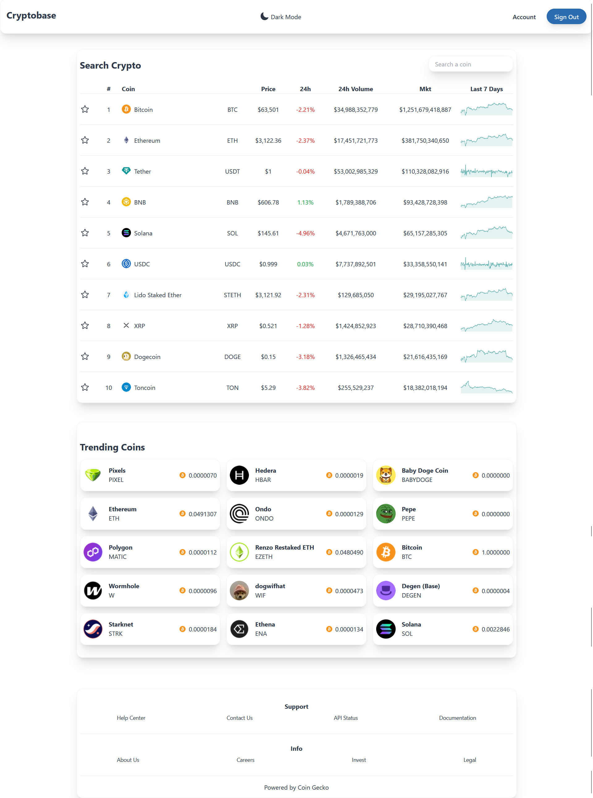
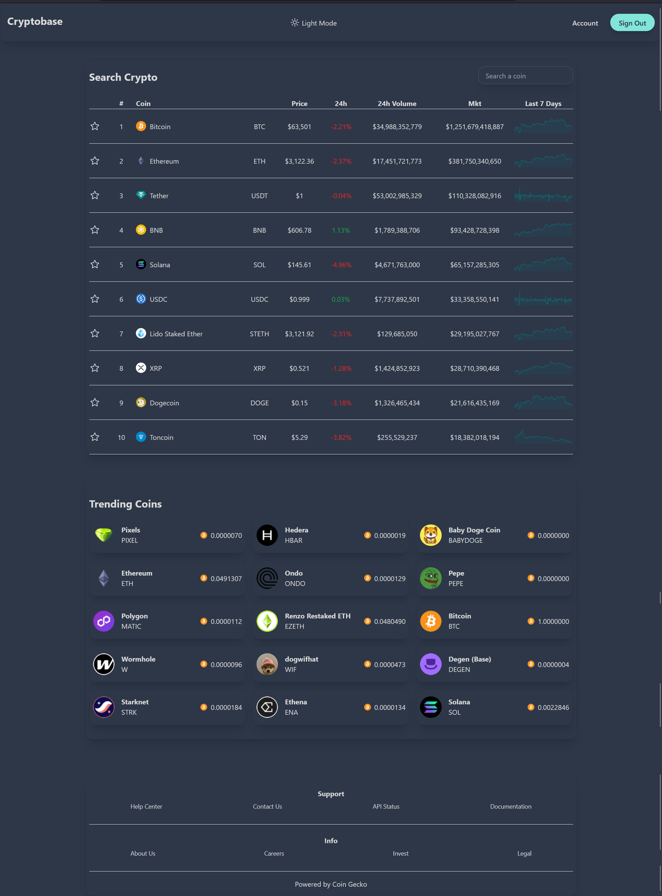
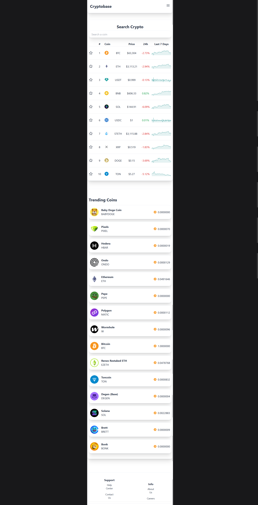
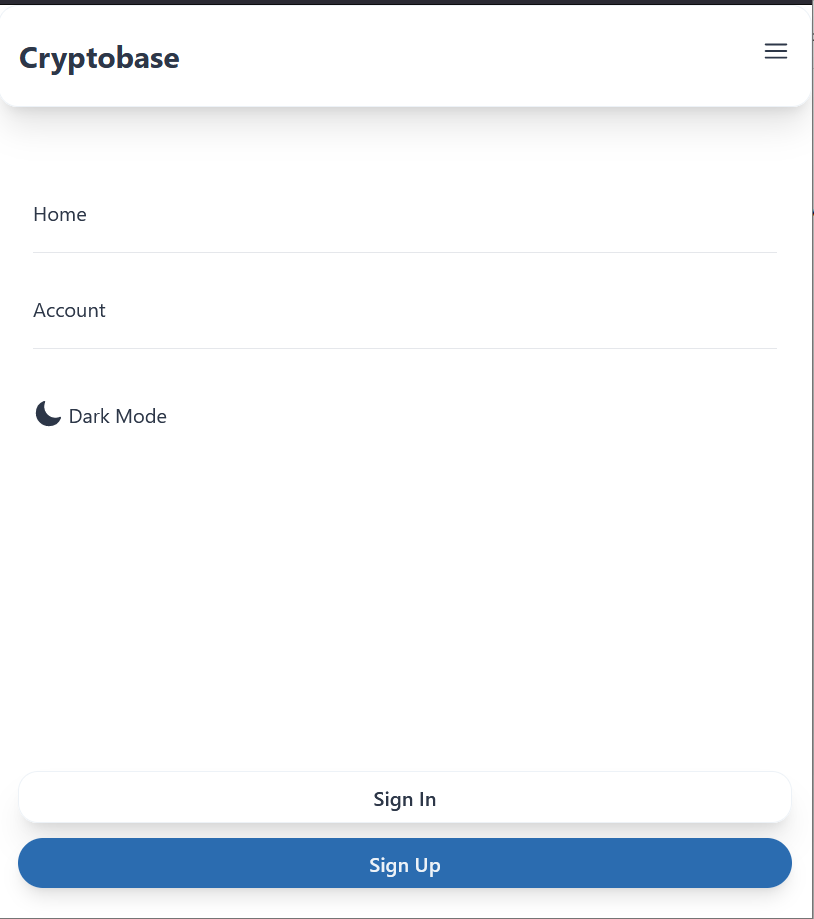
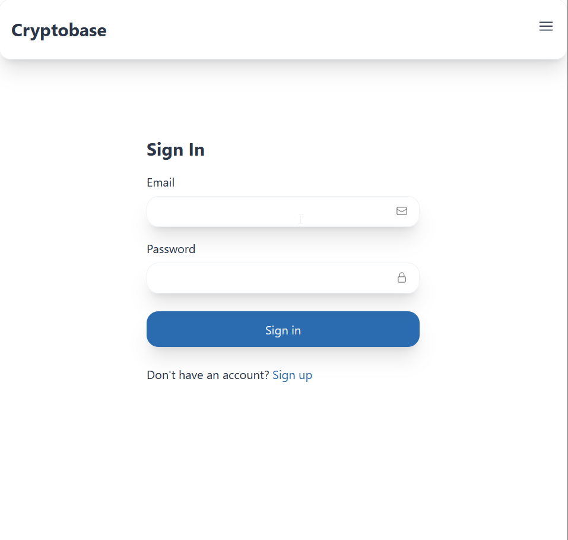
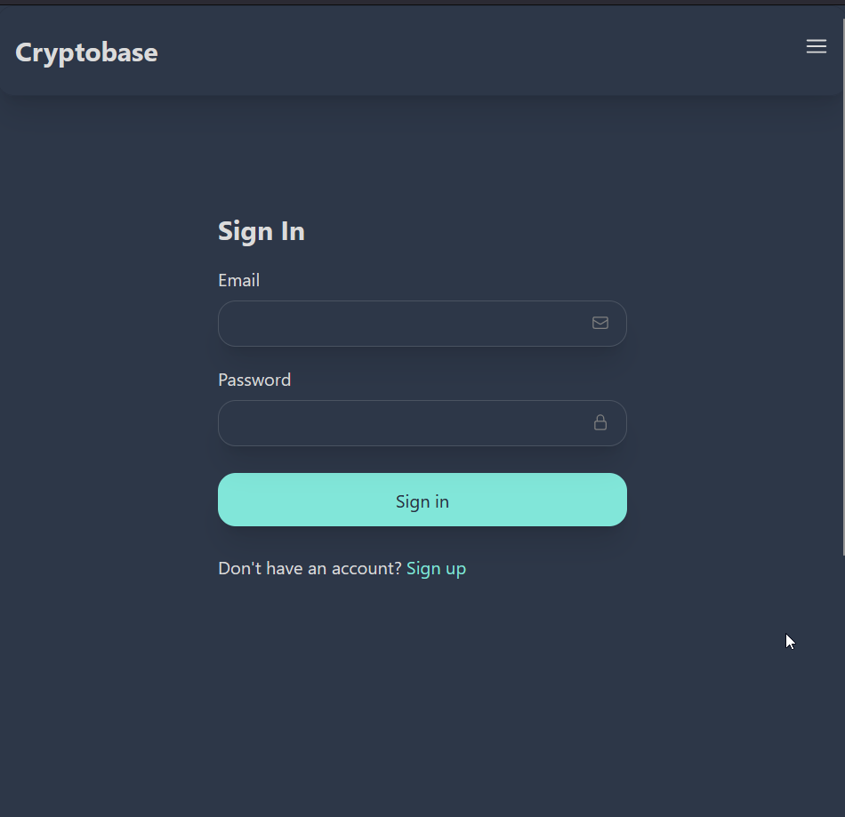
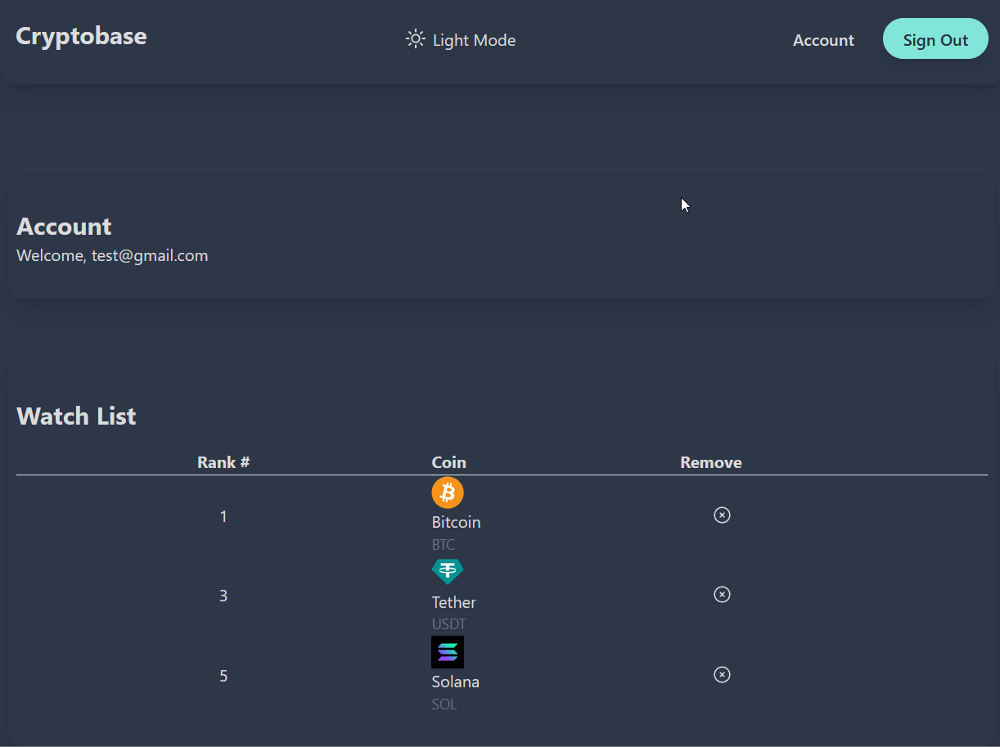

# Crypto Project

## Introduction

## Features

**Screenshots**

### Full App Interface - Light Mode

### Full App Interface - Dark Mode

### Mobile View

### Sidebar for smaller devices

### Sign in page - Light Mode

### Sign in page - Dark Mode

### Account page - Watchlist

## Installation

### Prerequisites

### Setup

1.  **Clone the repository.**

2.  **Navigate to the Projcet Directories**

3.  **Install dependencies**

4.  **Start the Servers**
